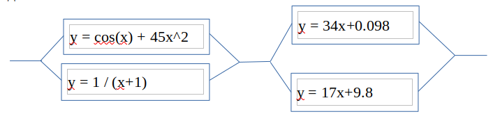

**Задание 12**

Написать программу на C/C++/Java, которая вычисляет сумму значений функции на указанном участке [0, 3.14] с шагом 0.0000001 и выводит среднее значение полученных сумм. Вычисление должно происходить с использованием параллельных потоков согласно представленной схеме.

