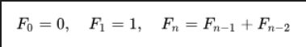

**Задание 14**

Написать на Erlang/Elixir приложение сервер генератор чисел фибоначи. Get возвращает следующее число (call), reset сбрасывает генератор на начальное значение (cast). Для реализации можно использовать поведение gen_server

Числа фибоначи:

первый вызов get возвращает 1, второй 2, третий 3, четвёртый 5, и так далее