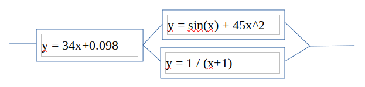

**Задание 3**

Написать программу на Erlang/Elixir, которая вычисляет сумму значений функции на указанном участке [0, 6.28] с шагом 0.0000001 и выводит среднее значение полученных сумм. Вычисление должно происходить с использованием параллельных потоков согласно представленной схеме.

